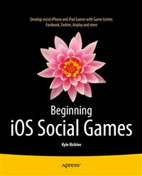

#Apress Source Code

This repository accompanies [*Beginning iOS Social Games*](http://www.apress.com/9781430249054) by Kyle Richter (Apress, 2013).

Download the files as a zip using the green button, or clone the repository to your machine using Git.

##Releases

Release v1.0 corresponds to the code in the published book, without corrections or updates.

##Contributions

See the file Contributing.md for more information on how you can contribute to this repository.

#From the Author

You will find two copies of the source code for each chapter one using Automatic Reference Counting and the other using standard memory management. The source code is otherwise the same. 

If you find any errors or issues please report them to kyle@dragonforged.com, likewise if you have any questions that I may be able to assist with. Enjoy your journey with social gaming!

Kyle Richter